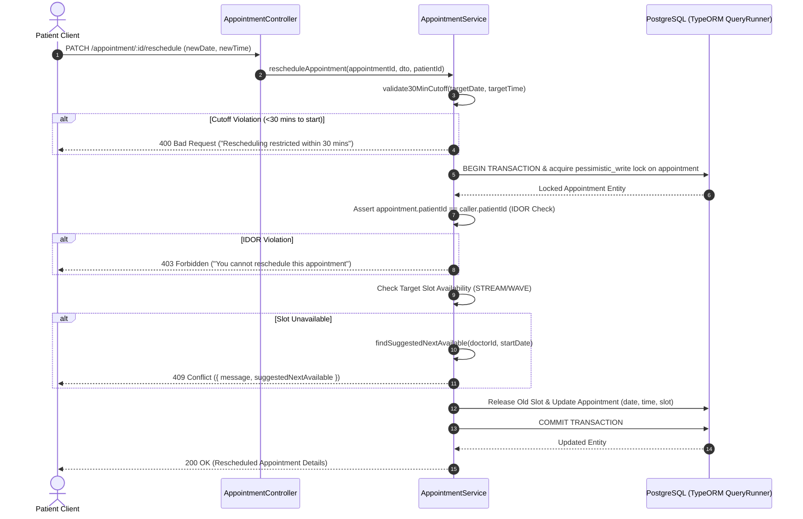

# 🗓️ Schedula — Enterprise Medical Appointment & Elastic Scheduling Engine

[](https://nestjs.com/)
[](https://www.typescriptlang.org/)
[](https://www.postgresql.org/)
[](https://typeorm.io/)
[](LICENSE)
[](https://schedula-backend-45oj.onrender.com/)

**Schedula** is a production-grade, highly reliable medical appointment scheduling backend engineered with **NestJS**, **TypeScript**, and **PostgreSQL (Neon Cloud DB over TLS)**. It features polymorphic scheduling strategies (**STREAM** 1-on-1 time slots & **WAVE** window-based token allocations), transactional row locking (`pessimistic_write`), database partial unique index safeguards, 30-minute pre-start rescheduling cutoffs, IDOR-protected cancellations, and automatic next-available slot discovery.

---

## 🌐 Live Application Deployment

- **Live Deployed API Base URL**: [`https://schedula-backend-45oj.onrender.com/`](https://schedula-backend-45oj.onrender.com/)
- **Live Health Reachability Status**: `200 OK`
- **Hosted Database**: Neon Cloud PostgreSQL v17 (AWS `us-east-1` over TLS)

---

## 📌 Problem Statement & Core Value Proposition

Healthcare scheduling systems face severe concurrency and operational challenges:
1. **Double-Booking Under High Concurrency**: Multi-patient booking spikes on popular doctor availability slots often result in race conditions.
2. **Rigid Strategy Support**: Traditional systems force doctors into fixed time slots, neglecting high-throughput walk-in wave windows.
3. **Rescheduling Collisions**: Last-minute appointment shifts lead to corrupted slot availability or orphaned tokens.

**Schedula** solves these challenges through:
- **Polymorphic Scheduling Engine**: Dynamic support for **STREAM** (individual fixed-duration slots + buffer time) and **WAVE** (max-patient token allocation windows).
- **Pessimistic Transactional Row Locks**: Acquires TypeORM `pessimistic_write` locks during appointment modification, eliminating race conditions.
- **Database Partial Unique Indexes**: Enforces slot uniqueness directly in PostgreSQL (`WHERE status = 'CONFIRMED'`), ensuring storage-level integrity even under heavy load.
- **Automatic Alternative Discovery**: Returns `409 Conflict` with a populated `suggestedNextAvailable` slot object whenever a desired slot or window is full.

---

## 🏗️ Architecture & System Design

Schedula is built following a clean **4-Tier NestJS Architecture** (Controller $\rightarrow$ Service $\rightarrow$ Repository $\rightarrow$ Database Layer) with strict domain isolation and DTO validation.

```
┌────────────────────────────────────────────────────────────────────────┐
│                        HTTP REQUEST TRANSPORT LAYER                    │
│   - Global ValidationPipe ({ whitelist: true })                        │
│   - JwtAuthGuard -> RolesGuard (@Roles('DOCTOR' | 'PATIENT' | 'ADMIN')) │
└────────────────────────────────────────────────────────────────────────┘
                                    │
                                    ▼
┌────────────────────────────────────────────────────────────────────────┐
│                          APPLICATION CONTROLLERS                       │
│  - AuthController          (/auth/signup, /auth/login)                 │
│  - DoctorController        (/doctor/profile)                           │
│  - PatientController       (/patient/profile)                          │
│  - DoctorsSchedulingCtrl   (/doctors/:doctorId/scheduling)             │
│  - AppointmentController   (/appointment/book, /appointment/reschedule)│
└────────────────────────────────────────────────────────────────────────┘
                                    │
                                    ▼
┌────────────────────────────────────────────────────────────────────────┐
│                           DOMAIN SERVICES                              │
│  - AppointmentService      (Rescheduling Engine & Lock Manager)        │
│  - DoctorAvailabilityServ  (Slot Calculation & Overrides)             │
│  - SchedulingConfigServ    (Strategy Engine)                           │
└────────────────────────────────────────────────────────────────────────┘
                                    │
                                    ▼
┌────────────────────────────────────────────────────────────────────────┐
│                         PERSISTENCE STORAGE                            │
│  - TypeORM QueryRunner Transaction (pessimistic_write locks)          │
│  - Neon PostgreSQL v17 (Partial Unique Indexes & Partial FKs)          │
└────────────────────────────────────────────────────────────────────────┘
```

---

## 🔄 Sequence Diagram: Appointment Rescheduling Engine



---

## 📁 Repository Directory Structure

```
schedula-jagadeesh/
├── .gitattributes                  # Vendor setup for 99% TypeScript Linguist classification
├── package.json                    # Project dependencies & npm scripts
├── tsconfig.json                   # TypeScript compiler configuration
├── nest-cli.json                   # NestJS CLI configuration
├── run-tests.js                    # Core Auth & Availability Test Suite (28 Scenarios)
├── test-appointment-management.js  # Booking & IDOR Cancellation Test Suite (19 Scenarios)
├── test-advanced-scheduling.js     # STREAM/WAVE Concurrency Test Suite (26 Scenarios)
├── test-rescheduling-suite.js      # Rescheduling & Cutoff Test Suite (12 Scenarios)
└── src/
    ├── main.ts                     # NestJS Bootstrap, CORS, ValidationPipe
    ├── app.module.ts              # Root AppModule, TypeORM connection, feature module imports
    ├── auth/                      # Authentication module (JWT, Bcrypt, Login/Signup)
    │   ├── auth.controller.ts
    │   ├── auth.service.ts
    │   ├── auth.module.ts
    │   └── jwt.strategy.ts
    ├── doctor/                    # Doctor profile management
    │   ├── doctor.controller.ts
    │   ├── doctor.service.ts
    │   └── entities/doctor.entity.ts
    ├── patient/                   # Patient profile management
    │   ├── patient.controller.ts
    │   ├── patient.service.ts
    │   └── entities/patient.entity.ts
    ├── guards/                    # Security guards
    │   ├── jwt-auth.guard.ts
    │   └── roles.guard.ts
    ├── scheduling/                # Core Scheduling Engine
    │   ├── controllers/
    │   │   ├── appointment.controller.ts
    │   │   └── doctors-scheduling.controller.ts
    │   ├── services/
    │   │   ├── appointment.service.ts
    │   │   ├── doctor-availability.service.ts
    │   │   └── scheduling-config.service.ts
    │   ├── dto/                   # DTOs with class-validator decorators
    │   │   ├── create-appointment.dto.ts
    │   │   ├── reschedule-appointment.dto.ts
    │   │   └── doctor-scheduling-config.dto.ts
    │   └── entities/
    │       ├── appointment.entity.ts
    │       ├── doctor-availability.entity.ts
    │       ├── doctor-date-override.entity.ts
    │       └── doctor-scheduling-config.entity.ts
    └── migrations/                # Code-First TypeORM Migrations
        ├── 1784700000000-InitialSchema.ts
        ├── 1784800000000-AddAppointments.ts
        └── 1784900000001-CreateAdvancedScheduling.ts
```

---

## 🗄️ Database Design & Partial Unique Indexes

Schedula utilizes PostgreSQL **Partial Unique Indexes** to enforce slot uniqueness directly at the database engine layer for active bookings while allowing historical cancelled records to persist for audit trails.

```sql
-- STREAM Strategy: Prevents double-booking the same exact slot for active appointments
CREATE UNIQUE INDEX idx_stream_slot_unique 
ON appointments (doctor_id, appointment_date, slot_start_time) 
WHERE status = 'CONFIRMED' AND appointment_type = 'STREAM';

-- WAVE Strategy: Enforces single patient per window and unique token allocation
CREATE UNIQUE INDEX idx_wave_window_patient_unique 
ON appointments (doctor_id, appointment_date, slot_start_time, patient_id) 
WHERE status = 'CONFIRMED' AND appointment_type = 'WAVE';

CREATE UNIQUE INDEX idx_wave_window_token_unique 
ON appointments (doctor_id, appointment_date, slot_start_time, token_number) 
WHERE status = 'CONFIRMED' AND appointment_type = 'WAVE';
```

---

## 🛠️ Technology Stack & Dependencies

| Layer | Component | Version / Library |
| :--- | :--- | :--- |
| **Core Framework** | NestJS | `v11.0.1` |
| **Language** | TypeScript | `v5.7.3` (`tsc --noEmit` clean) |
| **Database Engine**| PostgreSQL | `v17` (Neon Serverless PostgreSQL over TLS) |
| **ORM** | TypeORM | `v1.1.0` (Code-first migrations enabled) |
| **Authentication** | Passport.js + JWT | `@nestjs/jwt^11.0.0`, `passport-jwt^4.0.1` |
| **Password Security**| Bcrypt | `bcrypt^5.1.1` (Salt rounds: 10) |
| **Validation** | Class Validator | `class-validator^0.14.1`, `class-transformer^0.5.1` |

---

## 🔑 Key Features & Subsystems

### 1. STREAM & WAVE Scheduling Strategies
- **STREAM**: Generates discrete time slots (e.g. 15-minute appointment slots with 5-minute buffer intervals) based on doctor operational windows.
- **WAVE**: Assigns sequential token numbers (Token #1, Token #2, etc.) to patients booking within a fixed time window up to a maximum patient capacity (e.g. max 5 patients per 1-hour window).

### 2. Appointment Rescheduling Engine & Cutoff Guard
- **Pre-Start Cutoff Rule**: Rejects rescheduling requests attempted within 30 minutes of appointment start time (`400 Bad Request`).
- **Atomic Slot Swap**: Releases old slot reservation and acquires new slot inside a single TypeORM transaction with `pessimistic_write` row locks.
- **Conflict Resolution**: If the target slot is unavailable, scans the upcoming 14 days and returns `409 Conflict` with `suggestedNextAvailable`.

---

## 📑 Complete API Endpoint Table (22 Endpoints)

| Method | Path Alias 1 | Path Alias 2 | Auth Required | Description |
| :--- | :--- | :--- | :---: | :--- |
| `POST` | `/auth/signup` | — | No | Register new Doctor or Patient account |
| `POST` | `/auth/login` | — | No | Authenticate user & receive JWT Bearer token |
| `POST` | `/doctor/profile` | — | Yes (`DOCTOR`) | Create or update Doctor profile |
| `GET` | `/doctor/profile` | — | Yes (`DOCTOR`) | Get authenticated Doctor profile |
| `POST` | `/patient/profile` | — | Yes (`PATIENT`) | Create or update Patient profile |
| `GET` | `/patient/profile` | — | Yes (`PATIENT`) | Get authenticated Patient profile |
| `POST` | `/doctor/availability` | — | Yes (`DOCTOR`) | Create recurring weekly availability slot |
| `GET` | `/doctor/availability` | — | Yes (`DOCTOR`) | List recurring availability slots |
| `POST` | `/doctor/availability/override` | — | Yes (`DOCTOR`) | Set specific date override (e.g. Day Off) |
| `GET` | `/doctor/availability/date` | — | Yes | Query available slots for a doctor on date |
| `POST` | `/doctors/:doctorId/scheduling` | `/doctor/:doctorId/scheduling` | Yes (`ADMIN` / `DOCTOR`) | Setup STREAM or WAVE scheduling strategy |
| `GET` | `/doctors/:doctorId/scheduling` | `/doctor/:doctorId/scheduling` | Yes | Get doctor scheduling strategy config |
| `GET` | `/doctors/:doctorId/availability/windows` | `/doctor/:doctorId/availability/windows` | Yes | Get available slot windows for doctor |
| `POST` | `/appointment/book` | `/appointments/book` | Yes (`PATIENT`) | Book STREAM slot or WAVE token appointment |
| `GET` | `/appointment/my-appointments` | `/appointments/my-appointments` | Yes (`PATIENT`) | List authenticated patient's appointments |
| `PATCH`| `/appointment/:id/cancel` | `/appointments/:id/cancel` | Yes (`PATIENT`) | Cancel appointment with IDOR check |
| `PATCH`| `/appointment/:id/reschedule` | `/appointments/:id/reschedule` | Yes (`PATIENT`) | Reschedule appointment (30-min cutoff) |
| `GET` | `/doctor/appointments` | — | Yes (`DOCTOR`) | List doctor's appointments by date range |
| `GET` | `/doctor/appointments/today` | — | Yes (`DOCTOR`) | Get doctor's appointments scheduled for today |

---

## ⚡ Quick Start & Local Setup Guide

### Prerequisites
- Node.js `v20.18.0` or higher
- PostgreSQL instance running locally or a Neon DB cloud connection string

### 1. Installation
```bash
git clone https://github.com/Jagadeesh729/schedula-jagadeesh.git
cd schedula-jagadeesh
npm install
```

### 2. Environment Variables (`.env`)
Create a `.env` file in the project root:
```env
PORT=3000
DATABASE_HOST=localhost
DATABASE_PORT=5432
DATABASE_USER=postgres
DATABASE_PASSWORD=postgres
DATABASE_NAME=schedula_db
DATABASE_SSL=false
JWT_SECRET=your_super_secret_jwt_key_here
```

### 3. Database Migration Execution
```bash
# Run TypeORM migrations to set up tables and partial indexes
npm run migration:run
```

### 4. Build & Run Application
```bash
# Development mode
npm run start:dev

# Production build & start
npm run build
npm run start:prod
```

---

## 🧪 Automated Test Suite Execution

The repository includes 4 comprehensive integration test runner scripts verifying 85 total test scenarios:

```bash
# 1. Type Check (Ensure 0 compilation errors)
npx tsc --noEmit

# 2. Run Auth & Availability Suite (28 Scenarios)
node run-tests.js

# 3. Run Appointment Booking & IDOR Cancellation Suite (19 Scenarios)
node test-appointment-management.js

# 4. Run Advanced STREAM & WAVE Concurrency Suite (26 Scenarios)
node test-advanced-scheduling.js

# 5. Run Rescheduling & 30-Min Cutoff Suite (12 Scenarios)
node test-rescheduling-suite.js
```

Archived test execution log file preserved at: [`scratch/logs/test-execution.log`](file:///C:/Users/kunda/.gemini/antigravity/brain/01ac7018-4860-437d-84e1-5df4ec62fd37/scratch/logs/test-execution.log).

---

## 📄 License & Author

- **Author**: Jagadeesh ([@Jagadeesh729](https://github.com/Jagadeesh729))
- **License**: MIT License — see [LICENSE](LICENSE) for details.
