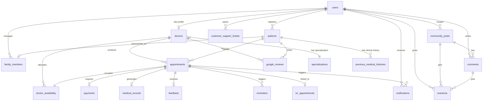

# Schedula (schedula-jagadeesh) - Backend Project Setup & System Design

Schedula is a healthcare booking and live queue management system designed to resolve clinic wait times, rigid scheduling, and doctor-patient pre-consultation information gaps. 

This repository contains the **Day 1 System Design, Database Architecture, and NestJS Project Setup**, aligned with both the core wireframe requirements and the group's reference structure.

---

## 1. Project Overview
Schedula solves high visiting and waiting times, rigid booking structures, and lack of pre-consultation clarity. Key modules:
1. **Core Scheduling & Dynamic Allocation Engine**: Date/time picking, slot expiration routing, and IVR App ID integrations.
2. **Live Queue Tracking & Upfront Payments**: Upfront fee transactions and active queue calculations (expected consultation time).
3. **Pre-Consultation Data Intake & AI Chat**: Intake forms, automatic triage advice, and a Friends & Family index for 1-click booking.
4. **Post-Visit Retention Loops**: Multi-tier rating feedbacks, daily re-engagement notifications, and Google Business redirection.

---

## 2. Tech Stack
- **Backend Framework**: [NestJS](https://nestjs.com/) (v11.x)
- **Language**: [TypeScript](https://www.typescriptlang.org/) (v5.x)
- **Platform**: [Node.js](https://nodejs.org/) (v24.x)
- **Package Manager**: [npm](https://www.npmjs.com/) (v11.x)
- **Database (Target)**: PostgreSQL
- **ORM (Target)**: TypeORM

---

## 3. Folder Structure
The project uses the standard NestJS architecture. No custom controllers, services, or modules have been added yet to preserve clean, default structure.

```text
schedula-jagadeesh/
├── dist/                   # Compiled JavaScript output
├── node_modules/           # Project dependencies
├── src/                    # Source files
│   ├── app.controller.spec.ts  # Unit tests for the AppController
│   ├── app.controller.ts       # App entry controller
│   ├── app.module.ts           # Root module of the application
│   ├── app.service.ts          # Core application service
│   └── main.ts                 # Application entry point (bootstrap)
├── test/                   # Integration tests
│   ├── app.e2e-spec.ts         # End-to-end testing
│   └── jest-e2e.json           # Jest E2E configuration
├── .prettierrc             # Prettier code formatting rules
├── eslint.config.mjs       # ESLint linting configuration
├── nest-cli.json           # NestJS CLI configuration
├── package.json            # npm package dependencies and scripts
├── tsconfig.build.json     # TypeScript build compiler options
├── tsconfig.json           # Main TypeScript configuration
└── README.md               # Main project documentation
```

### Folder Explanations:
- **`src/`**: Contains the main application source code.
  - **`app.module.ts`**: The root module of the NestJS application where all other modules, controllers, and services are declared.
  - **`app.controller.ts`**: Handles incoming HTTP requests and delegates tasks to service layer.
  - **`app.service.ts`**: Contains basic business logic for the app.
  - **`main.ts`**: Uses `NestFactory` to bootstrap the application and make it listen on port `3000`.
- **`test/`**: Contains E2E tests to verify system routes.
- **`dist/`**: Contains built files created by compiling TypeScript to JavaScript.
- **`nest-cli.json`**: Specifies CLI options, e.g., script entry points and build tools.

---

## 4. Database Overview & Schema Design
To support the application's workflows, the PostgreSQL database is designed with **18 core entities**, aligning the group reference diagram's table splits with full wireframe screen coverage (including Friends & Family, IVR, and Community features) in a normalized, 3NF-compliant structure.

### 4.1. users
Stores authentication details for users.
- `id` (UUID, PK)
- `email` (VARCHAR, UNIQUE, NOT NULL, Index)
- `mobile_number` (VARCHAR, UNIQUE, NOT NULL, Index)
- `role` (VARCHAR) - 'PATIENT', 'DOCTOR'
- `created_at` (TIMESTAMP)

### 4.2. doctors
Stores metadata for doctors practicing in clinics.
- `id` (UUID, PK)
- `user_id` (UUID, FK -> users, UNIQUE, Index)
- `specialization_id` (UUID, FK -> specializations, Index)
- `name` (VARCHAR)
- `qualification` (VARCHAR)
- `experience_years` (INTEGER)
- `clinic_name` (VARCHAR)
- `consultation_fee` (DECIMAL)
- `created_at` (TIMESTAMP)

### 4.3. specializations
Lookup table for doctor specializations (aligned with reference diagram).
- `id` (UUID, PK)
- `name` (VARCHAR, UNIQUE, NOT NULL)
- `description` (TEXT)

### 4.4. doctor_availability
Defines doctors' bookable calendar time slots (aligned with reference diagram).
- `id` (UUID, PK)
- `doctor_id` (UUID, FK -> doctors, Index)
- `slot_date` (DATE)
- `day_of_week` (VARCHAR) - 'MONDAY', 'TUESDAY', etc.
- `start_time` (TIME)
- `end_time` (TIME)
- `max_tokens` (INTEGER)
- `created_at` (TIMESTAMP)

### 4.5. patients
Stores clinical profile data.
- `id` (UUID, PK)
- `user_id` (UUID, FK -> users, Index)
- `first_name` (VARCHAR)
- `last_name` (VARCHAR)
- `gender` (VARCHAR)
- `date_of_birth` (DATE)
- `profile_picture_url` (VARCHAR)
- `created_at` (TIMESTAMP)

### 4.6. appointments
Records consultation bookings.
- `id` (UUID, PK)
- `patient_id` (UUID, FK -> patients, Index)
- `doctor_id` (UUID, FK -> doctors, Index)
- `slot_id` (UUID, FK -> doctor_availability, Index)
- `consultation_type` (VARCHAR) - 'ONLINE', 'OFFLINE'
- `appointment_date` (DATE)
- `token_number` (INTEGER)
- `status` (VARCHAR) - 'BOOKED', 'COMPLETED', 'CANCELLED', 'RESCHEDULED', 'PENDING'
- `current_consulting_count` (INTEGER)
- `expected_consulting_time` (TIME)
- `payment_reference` (VARCHAR, NULLABLE)
- `created_at` (TIMESTAMP)

### 4.7. medical_records
Stores consultation findings (normalized into a separate table linked 1-to-1 with appointments).
- `id` (UUID, PK)
- `appointment_id` (UUID, FK -> appointments, UNIQUE, Index)
- `complaint` (TEXT)
- `diagnosis` (TEXT)
- `prescription` (TEXT)
- `doctor_notes` (TEXT, NULLABLE)
- `follow_up_advice` (TEXT, NULLABLE)
- `created_at` (TIMESTAMP)

### 4.8. previous_medical_histories
Stores patient historical profiles (normalized into a separate table linked to patients).
- `id` (UUID, PK)
- `patient_id` (UUID, FK -> patients, Index)
- `ailments_history` (TEXT)
- `past_diagnoses` (TEXT)
- `medications_history` (TEXT)
- `allergies` (TEXT)
- `surgeries` (TEXT)
- `family_medical_history` (TEXT)
- `lifestyle_notes` (TEXT)
- `created_at` (TIMESTAMP)

### 4.9. payments
Tracks upfront consultation payments.
- `id` (UUID, PK)
- `appointment_id` (UUID, FK -> appointments, UNIQUE, Index)
- `amount` (DECIMAL)
- `method` (VARCHAR) - 'UPI', 'CARD', 'WALLET', 'CASH', 'OTHER'
- `status` (VARCHAR) - 'SUCCESS', 'FAILED', 'PENDING', 'REFUNDED'
- `transaction_id` (VARCHAR, UNIQUE)
- `transaction_time` (TIMESTAMP)
- `created_at` (TIMESTAMP)

### 4.10. notifications
Logs system alerts.
- `id` (UUID, PK)
- `user_id` (UUID, FK -> users, Index)
- `appointment_id` (UUID, FK -> appointments, Index)
- `type` (VARCHAR) - 'REMINDER', 'BOOKING', 'CANCELLATION', 'RESCHEDULED', 'OTHER'
- `message` (TEXT)
- `status` (VARCHAR) - 'UNREAD', 'READ'
- `sent_at` (TIMESTAMP)

### 4.11. feedback
Tracks doctor and hospital ratings.
- `id` (UUID, PK)
- `appointment_id` (UUID, FK -> appointments, UNIQUE, Index)
- `doctor_rating` (INTEGER)
- `hospital_rating` (INTEGER)
- `waiting_time_rating` (INTEGER)
- `comment` (TEXT)
- `feedback_date` (TIMESTAMP)

### 4.12. google_reviews
Handles satisfied patient redirections.
- `id` (UUID, PK)
- `doctor_id` (UUID, FK -> doctors, Index)
- `patient_id` (UUID, FK -> patients, Index)
- `rating` (INTEGER)
- `review` (TEXT)
- `created_at` (TIMESTAMP)

### 4.13. customer_support_tickets
Customer helpdesk.
- `id` (UUID, PK)
- `patient_id` (UUID, FK -> patients, Index)
- `issue_description` (TEXT)
- `status` (VARCHAR) - 'OPEN', 'IN_PROGRESS', 'RESOLVED', 'CLOSED'
- `created_at` (TIMESTAMP)
- `updated_at` (TIMESTAMP)

### 4.14. family_members
Connects users to dependent patient profiles (required for Page 24).
- `id` (UUID, PK)
- `user_id` (UUID, FK -> users, Index)
- `patient_id` (UUID, FK -> patients, UNIQUE, Index)
- `relationship` (VARCHAR) - 'Wife', 'Son', 'Daughter', 'Mother', 'Father', 'Self'
- `created_at` (TIMESTAMP)

### 4.15. ivr_appointments
Integrates bookings initiated via interactive voice systems (required for Page 21).
- `id` (UUID, PK)
- `appointment_id` (UUID, FK -> appointments, UNIQUE, Index)
- `ivr_app_id` (VARCHAR, UNIQUE, Index)
- `status` (VARCHAR)
- `created_at` (TIMESTAMP)

### 4.16. reminders
Triggers scheduled alerts before appointment times.
- `id` (UUID, PK)
- `appointment_id` (UUID, FK -> appointments, Index)
- `scheduled_time` (TIMESTAMP)
- `sent` (BOOLEAN, Default FALSE)
- `created_at` (TIMESTAMP)

### 4.17. community_posts
Enables patient-to-patient sharing (required for Page 22).
- `id` (UUID, PK)
- `user_id` (UUID, FK -> users, Index)
- `title` (VARCHAR)
- `content` (TEXT)
- `created_at` (TIMESTAMP)

### 4.18. comments
Discussion replies (required for Page 22).
- `id` (UUID, PK)
- `post_id` (UUID, FK -> community_posts, Index)
- `user_id` (UUID, FK -> users, Index)
- `content` (TEXT)
- `created_at` (TIMESTAMP)

### 4.19. reactions
Likes and reactions on posts/comments (required for Page 22).
- `id` (UUID, PK)
- `user_id` (UUID, FK -> users, Index)
- `post_id` (UUID, FK -> community_posts, NULLABLE, Index)
- `comment_id` (UUID, FK -> comments, NULLABLE, Index)
- `type` (VARCHAR) - 'LIKE', 'LOVE', 'SUPPORT'
- `created_at` (TIMESTAMP)

---

## 5. ER Diagram

### 5.1. Mermaid ER Code


### 5.2. DBML (Database Markup Language)
```dbml
Table users {
  id uuid [pk]
  email varchar [unique, not null]
  mobile_number varchar [unique, not null]
  role varchar [not null]
  created_at timestamp
}

Table specializations {
  id uuid [pk]
  name varchar [unique, not null]
  description text
}

Table doctors {
  id uuid [pk]
  user_id uuid [ref: > users.id, unique]
  specialization_id uuid [ref: > specializations.id]
  name varchar
  qualification varchar
  experience_years integer
  clinic_name varchar
  consultation_fee decimal
  created_at timestamp
}

Table doctor_availability {
  id uuid [pk]
  doctor_id uuid [ref: > doctors.id]
  slot_date date
  day_of_week varchar
  start_time time
  end_time time
  max_tokens integer
  created_at timestamp
}

Table patients {
  id uuid [pk]
  user_id uuid [ref: > users.id]
  first_name varchar
  last_name varchar
  gender varchar
  date_of_birth date
  profile_picture_url varchar
  created_at timestamp
}

Table appointments {
  id uuid [pk]
  patient_id uuid [ref: > patients.id]
  doctor_id uuid [ref: > doctors.id]
  slot_id uuid [ref: > doctor_availability.id]
  consultation_type varchar
  appointment_date date
  token_number integer
  status varchar
  current_consulting_count integer
  expected_consulting_time time
  payment_reference varchar
  created_at timestamp
}

Table medical_records {
  id uuid [pk]
  appointment_id uuid [ref: > appointments.id, unique]
  complaint text
  diagnosis text
  prescription text
  doctor_notes text
  follow_up_advice text
  created_at timestamp
}

Table previous_medical_histories {
  id uuid [pk]
  patient_id uuid [ref: > patients.id]
  ailments_history text
  past_diagnoses text
  medications_history text
  allergies text
  surgeries text
  family_medical_history text
  lifestyle_notes text
  created_at timestamp
}

Table payments {
  id uuid [pk]
  appointment_id uuid [ref: > appointments.id, unique]
  amount decimal
  method varchar
  status varchar
  transaction_id varchar [unique]
  transaction_time timestamp
  created_at timestamp
}

Table notifications {
  id uuid [pk]
  user_id uuid [ref: > users.id]
  appointment_id uuid [ref: > appointments.id]
  type varchar
  message text
  status varchar
  sent_at timestamp
}

Table feedback {
  id uuid [pk]
  appointment_id uuid [ref: > appointments.id, unique]
  doctor_rating integer
  hospital_rating integer
  waiting_time_rating integer
  comment text
  feedback_date timestamp
}

Table google_reviews {
  id uuid [pk]
  doctor_id uuid [ref: > doctors.id]
  patient_id uuid [ref: > patients.id]
  rating integer
  review text
  created_at timestamp
}

Table customer_support_tickets {
  id uuid [pk]
  patient_id uuid [ref: > patients.id]
  issue_description text
  status varchar
  created_at timestamp
  updated_at timestamp
}

Table family_members {
  id uuid [pk]
  user_id uuid [ref: > users.id]
  patient_id uuid [ref: > patients.id, unique]
  relationship varchar
  created_at timestamp
}

Table ivr_appointments {
  id uuid [pk]
  appointment_id uuid [ref: > appointments.id, unique]
  ivr_app_id varchar [unique]
  status varchar
  created_at timestamp
}

Table reminders {
  id uuid [pk]
  appointment_id uuid [ref: > appointments.id]
  scheduled_time timestamp
  sent boolean
  created_at timestamp
}

Table community_posts {
  id uuid [pk]
  user_id uuid [ref: > users.id]
  title varchar
  content text
  created_at timestamp
}

Table comments {
  id uuid [pk]
  post_id uuid [ref: > community_posts.id]
  user_id uuid [ref: > users.id]
  content text
  created_at timestamp
}

Table reactions {
  id uuid [pk]
  user_id uuid [ref: > users.id]
  post_id uuid [ref: > community_posts.id]
  comment_id uuid [ref: > comments.id]
  type varchar
  created_at timestamp
}
```

---

## 6. Installation & Execution
To get the empty NestJS template running locally:

```bash
# Clone and open directory
cd C:\Users\kunda\Downloads\schedula-jagadeesh

# Install dependencies
npm install

# Run the dev server
npm run start:dev

# Build the project
npm run build
```

---

## 7. Future Scope
1. **Module 1 (Scheduling)**: Write NestJS core modules (`SchedulingModule`, `SlotModule`) with controllers and queries filtering time slots by range and status.
2. **Module 2 (Queue & Payment)**: Implement transactional database locks to increment queue tokens concurrently and compute expected waiting times using running averages.
3. **Module 3 (Intake & Chatbot)**: Configure intake schemas, integrate an LLM interface (Gemini/OpenAI API) for home triage recommendations, and map family profiles.
4. **Module 4 (Feedback & Retention)**: Implement Star Ratings endpoints, CronJobs checking in on patients after 24 hours, and Deep-link redirect helpers.
