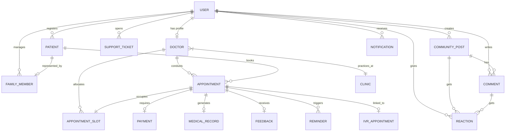

# Schedula (schedula-jagadeesh) - Backend Project Setup & System Design

Schedula is a healthcare booking and live queue management system designed to resolve clinic wait times, rigid scheduling, and doctor-patient pre-consultation information gaps. 

This repository contains the **Day 1 System Design, Database Architecture, and NestJS Project Setup**.

---

## 1. Project Overview
Schedula solves high visiting and waiting times, rigid booking structures, and lack of pre-consultation clarity. Key modules:
1. **Core Scheduling & Dynamic Allocation Engine**: Date/time picking, slot expiration routing, and IVR App ID integrations.
2. **Live Queue Tracking & Upfront Payments**: Upfront fee transactions and active queue calculations (expected consultation time).
3. **Pre-Consultation Data Intake & AI Chat**: Intake forms, automatic triage advice, and a Friends & Family index for 1-click booking.
4. **Post-Visit Retention Loops**: Multi-tier rating feedbacks, daily re-engagement notifications, and Google Business redirection.

---

## 2. Tech Stack
- **Framework**: [NestJS](https://nestjs.com/) (v11.x)
- **Language**: [TypeScript](https://www.typescriptlang.org/) (v5.x)
- **Platform**: [Node.js](https://nodejs.org/) (v24.x)
- **Package Manager**: [npm](https://www.npmjs.com/) (v11.x)
- **Database (Target)**: PostgreSQL
- **ORM (Target)**: TypeORM

---

## 3. Folder Structure
The project uses the standard NestJS architecture. No custom controllers, services, or modules have been added yet to preserve clean, default structure.

```text
schedula-jagadeesh/
├── dist/                   # Compiled JavaScript output
├── node_modules/           # Project dependencies
├── src/                    # Source files
│   ├── app.controller.spec.ts  # Unit tests for the AppController
│   ├── app.controller.ts       # App entry controller
│   ├── app.module.ts           # Root module of the application
│   ├── app.service.ts          # Core application service
│   └── main.ts                 # Application entry point (bootstrap)
├── test/                   # Integration tests
│   ├── app.e2e-spec.ts         # End-to-end testing
│   └── jest-e2e.json           # Jest E2E configuration
├── .prettierrc             # Prettier code formatting rules
├── eslint.config.mjs       # ESLint linting configuration
├── nest-cli.json           # NestJS CLI configuration
├── package.json            # npm package dependencies and scripts
├── tsconfig.build.json     # TypeScript build compiler options
├── tsconfig.json           # Main TypeScript configuration
└── README.md               # Main project documentation
```

### Folder Explanations:
- **`src/`**: Contains the main application source code.
  - **`app.module.ts`**: The root module of the NestJS application where all other modules, controllers, and services are declared.
  - **`app.controller.ts`**: Handles incoming HTTP requests and delegates tasks to service layer.
  - **`app.service.ts`**: Contains basic business logic for the app.
  - **`main.ts`**: Uses `NestFactory` to bootstrap the application and make it listen on port `3000`.
- **`test/`**: Contains E2E tests to verify system routes.
- **`dist/`**: Contains built files created by compiling TypeScript to JavaScript.
- **`nest-cli.json`**: Specifies CLI options, e.g., script entry points and build tools.

---

## 4. Database Overview & Schema Design
To support the application's workflows, the PostgreSQL database is designed with **17 core entities**.

### 4.1. User Table
Stores authentication details for users (patients, family members, or doctors).
- `id` (UUID, PK)
- `mobile_number` (VARCHAR, UNIQUE, NOT NULL, Index)
- `name` (VARCHAR)
- `created_at` (TIMESTAMP, Default NOW)
- `updated_at` (TIMESTAMP, Default NOW)

### 4.2. Doctor Table
Stores metadata for doctors practicing in clinics.
- `id` (UUID, PK)
- `user_id` (UUID, FK -> User, UNIQUE, Index)
- `clinic_id` (UUID, FK -> Clinic, Index)
- `specialization` (VARCHAR, NOT NULL)
- `experience_years` (INTEGER, NOT NULL)
- `achievements` (TEXT)
- `services` (TEXT[], NOT NULL)
- `consultation_fee` (DECIMAL, NOT NULL)
- `created_at` (TIMESTAMP)

### 4.3. Patient Table
Stores intake profiles. A user can create profiles for themselves or dependents.
- `id` (UUID, PK)
- `user_id` (UUID, FK -> User, Index) - Owner of this patient profile
- `name` (VARCHAR, NOT NULL)
- `age` (INTEGER, NOT NULL)
- `sex` (VARCHAR, NOT NULL)
- `weight` (DECIMAL)
- `created_at` (TIMESTAMP)

### 4.4. Appointment Table
Records consultation bookings.
- `id` (UUID, PK)
- `doctor_id` (UUID, FK -> Doctor, Index)
- `patient_id` (UUID, FK -> Patient, Index)
- `slot_id` (UUID, FK -> AppointmentSlot, UNIQUE, Index)
- `token_number` (INTEGER, NOT NULL)
- `type` (VARCHAR, NOT NULL) - 'Regular', 'Online'
- `visit_type` (VARCHAR, NOT NULL) - 'First time', 'Report', 'Follow-up'
- `status` (VARCHAR, NOT NULL) - 'Upcoming', 'Completed', 'Cancelled', 'No-show'
- `queue_status` (VARCHAR, NOT NULL) - 'Waiting', 'Consulted', 'Unable to meet'
- `expected_time` (TIMESTAMP) - Dynamically calculated queue time
- `created_at` (TIMESTAMP)

### 4.5. AppointmentSlot Table
Defines doctors' bookable calendar time slots.
- `id` (UUID, PK)
- `doctor_id` (UUID, FK -> Doctor, Index)
- `date` (DATE, NOT NULL)
- `start_time` (TIME, NOT NULL)
- `end_time` (TIME, NOT NULL)
- `max_capacity` (INTEGER, Default 1)
- `booked_count` (INTEGER, Default 0)
- `is_expired` (BOOLEAN, Default FALSE)
- `created_at` (TIMESTAMP)

### 4.6. Clinic Table
Represents clinical centers.
- `id` (UUID, PK)
- `name` (VARCHAR, NOT NULL)
- `address` (TEXT)
- `contact_number` (VARCHAR)
- `rating` (DECIMAL)
- `created_at` (TIMESTAMP)

### 4.7. Payment Table
Tracks upfront consultation payments.
- `id` (UUID, PK)
- `appointment_id` (UUID, FK -> Appointment, UNIQUE, Index)
- `amount` (DECIMAL, NOT NULL)
- `status` (VARCHAR, NOT NULL) - 'Pending', 'Paid', 'Refunded'
- `transaction_ref` (VARCHAR, UNIQUE, NOT NULL)
- `payment_date` (TIMESTAMP)
- `created_at` (TIMESTAMP)

### 4.8. Notification Table
Logs system notifications.
- `id` (UUID, PK)
- `user_id` (UUID, FK -> User, Index)
- `message` (TEXT, NOT NULL)
- `type` (VARCHAR, NOT NULL) - 'Reminder', 'Cancellation', 'Refund', 'Community'
- `is_read` (BOOLEAN, Default FALSE)
- `created_at` (TIMESTAMP)

### 4.9. MedicalRecord Table
Stores intake health issues and AI advice.
- `id` (UUID, PK)
- `appointment_id` (UUID, FK -> Appointment, UNIQUE, Index)
- `complaint` (TEXT, NOT NULL)
- `triage_advice` (TEXT)
- `symptoms` (TEXT)
- `notes` (TEXT)
- `created_at` (TIMESTAMP)

### 4.10. Feedback Table
Tracks doctor and clinic ratings.
- `id` (UUID, PK)
- `appointment_id` (UUID, FK -> Appointment, UNIQUE, Index)
- `doctor_rating` (INTEGER, Check 1-5, NOT NULL)
- `clinic_rating` (INTEGER, Check 1-5, NOT NULL)
- `wait_time_rating` (INTEGER, Check 1-5, NOT NULL)
- `comment` (TEXT)
- `created_at` (TIMESTAMP)

### 4.11. Reminder Table
Triggers notifications before appointment times.
- `id` (UUID, PK)
- `appointment_id` (UUID, FK -> Appointment, Index)
- `scheduled_time` (TIMESTAMP, NOT NULL)
- `sent` (BOOLEAN, Default FALSE)
- `created_at` (TIMESTAMP)

### 4.12. SupportTicket Table
Customer helpdesk.
- `id` (UUID, PK)
- `user_id` (UUID, FK -> User, Index)
- `subject` (VARCHAR, NOT NULL)
- `description` (TEXT, NOT NULL)
- `status` (VARCHAR, NOT NULL) - 'Open', 'Resolved'
- `created_at` (TIMESTAMP)

### 4.13. FamilyMember Table
Connects users to dependent patient profiles.
- `id` (UUID, PK)
- `user_id` (UUID, FK -> User, Index)
- `patient_id` (UUID, FK -> Patient, UNIQUE, Index)
- `relationship` (VARCHAR, NOT NULL) - 'Wife', 'Son', 'Daughter', 'Mother', 'Father', 'Self'
- `created_at` (TIMESTAMP)

### 4.14. IVRAppointment Table
Integrates bookings initiated via interactive voice systems.
- `id` (UUID, PK)
- `appointment_id` (UUID, FK -> Appointment, UNIQUE, Index)
- `ivr_app_id` (VARCHAR, UNIQUE, NOT NULL, Index)
- `status` (VARCHAR, NOT NULL) - 'Initiated', 'Completed', 'Expired'
- `created_at` (TIMESTAMP)

### 4.15. CommunityPost Table
Enables patient-to-patient sharing.
- `id` (UUID, PK)
- `user_id` (UUID, FK -> User, Index)
- `title` (VARCHAR, NOT NULL)
- `content` (TEXT, NOT NULL)
- `created_at` (TIMESTAMP)

### 4.16. Comment Table
Discussion replies.
- `id` (UUID, PK)
- `post_id` (UUID, FK -> CommunityPost, Index)
- `user_id` (UUID, FK -> User, Index)
- `content` (TEXT, NOT NULL)
- `created_at` (TIMESTAMP)

### 4.17. Reaction Table
Likes and reactions on posts/comments.
- `id` (UUID, PK)
- `user_id` (UUID, FK -> User, Index)
- `post_id` (UUID, FK -> CommunityPost, NULLABLE, Index)
- `comment_id` (UUID, FK -> Comment, NULLABLE, Index)
- `type` (VARCHAR, NOT NULL) - 'Like', 'Love', 'Support'
- `created_at` (TIMESTAMP)

---

## 5. ER Diagram

### 5.1. Mermaid ER Code
Copy and paste this code in [Mermaid Live Editor](https://mermaid.live) to visualize the schema:



### 5.2. DBML (Database Markup Language)
Copy and paste this schema code into [dbdiagram.io](https://dbdiagram.io):

```dbml
Table users {
  id uuid [pk]
  mobile_number varchar [unique, not null]
  name varchar
  created_at timestamp
  updated_at timestamp
}

Table clinics {
  id uuid [pk]
  name varchar [not null]
  address text
  contact_number varchar
  rating decimal
  created_at timestamp
}

Table doctors {
  id uuid [pk]
  user_id uuid [ref: > users.id, unique]
  clinic_id uuid [ref: > clinics.id]
  specialization varchar [not null]
  experience_years integer [not null]
  achievements text
  services text[]
  consultation_fee decimal [not null]
  created_at timestamp
}

Table patients {
  id uuid [pk]
  user_id uuid [ref: > users.id]
  name varchar [not null]
  age integer [not null]
  sex varchar [not null]
  weight decimal
  created_at timestamp
}

Table family_members {
  id uuid [pk]
  user_id uuid [ref: > users.id]
  patient_id uuid [ref: > patients.id, unique]
  relationship varchar [not null]
  created_at timestamp
}

Table appointment_slots {
  id uuid [pk]
  doctor_id uuid [ref: > doctors.id]
  date date [not null]
  start_time time [not null]
  end_time time [not null]
  max_capacity integer [default: 1]
  booked_count integer [default: 0]
  is_expired boolean [default: false]
  created_at timestamp
}

Table appointments {
  id uuid [pk]
  doctor_id uuid [ref: > doctors.id]
  patient_id uuid [ref: > patients.id]
  slot_id uuid [ref: > appointment_slots.id]
  token_number integer [not null]
  type varchar [not null]
  visit_type varchar [not null]
  status varchar [not null]
  queue_status varchar [not null]
  expected_time timestamp
  created_at timestamp
}

Table payments {
  id uuid [pk]
  appointment_id uuid [ref: > appointments.id, unique]
  amount decimal [not null]
  status varchar [not null]
  transaction_ref varchar [unique]
  payment_date timestamp
  created_at timestamp
}

Table notifications {
  id uuid [pk]
  user_id uuid [ref: > users.id]
  message text [not null]
  type varchar [not null]
  is_read boolean [default: false]
  created_at timestamp
}

Table medical_records {
  id uuid [pk]
  appointment_id uuid [ref: > appointments.id, unique]
  complaint text [not null]
  triage_advice text
  symptoms text
  notes text
  created_at timestamp
}

Table feedbacks {
  id uuid [pk]
  appointment_id uuid [ref: > appointments.id, unique]
  doctor_rating integer [not null]
  clinic_rating integer [not null]
  wait_time_rating integer [not null]
  comment text
  created_at timestamp
}

Table reminders {
  id uuid [pk]
  appointment_id uuid [ref: > appointments.id]
  scheduled_time timestamp [not null]
  sent boolean [default: false]
  created_at timestamp
}

Table support_tickets {
  id uuid [pk]
  user_id uuid [ref: > users.id]
  subject varchar [not null]
  description text [not null]
  status varchar [not null]
  created_at timestamp
}

Table ivr_appointments {
  id uuid [pk]
  appointment_id uuid [ref: > appointments.id, unique]
  ivr_app_id varchar [unique, not null]
  status varchar [not null]
  created_at timestamp
}

Table community_posts {
  id uuid [pk]
  user_id uuid [ref: > users.id]
  title varchar [not null]
  content text [not null]
  created_at timestamp
}

Table comments {
  id uuid [pk]
  post_id uuid [ref: > community_posts.id]
  user_id uuid [ref: > users.id]
  content text [not null]
  created_at timestamp
}

Table reactions {
  id uuid [pk]
  user_id uuid [ref: > users.id]
  post_id uuid [ref: > community_posts.id]
  comment_id uuid [ref: > comments.id]
  type varchar [not null]
  created_at timestamp
}
```

---

## 6. Installation & Execution
To get the empty NestJS template running locally:

```bash
# Clone and open directory
cd C:\Users\kunda\Downloads\schedula-jagadeesh

# Install dependencies
npm install

# Run the dev server
npm run start:dev

# Build the project
npm run build
```

---

## 7. Future Scope
1. **Module 1 (Scheduling)**: Write NestJS core modules (`SchedulingModule`, `SlotModule`) with controllers and queries filtering time slots by range and status.
2. **Module 2 (Queue & Payment)**: Implement transactional database locks to increment queue tokens concurrently and compute expected waiting times using running averages.
3. **Module 3 (Intake & Chatbot)**: Configure intake schemas, integrate an LLM interface (Gemini/OpenAI API) for home triage recommendations, and map family profiles.
4. **Module 4 (Feedback & Retention)**: Implement Star Ratings endpoints, CronJobs checking in on patients after 24 hours, and Deep-link redirect helpers.
