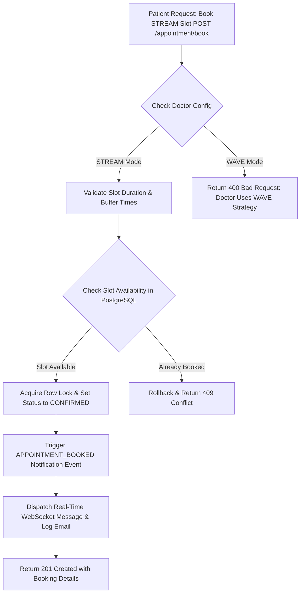
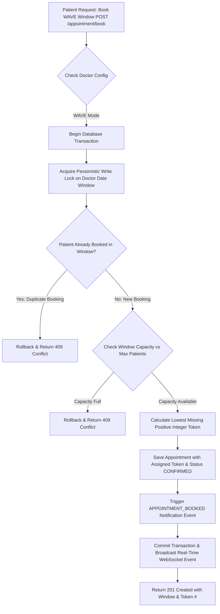
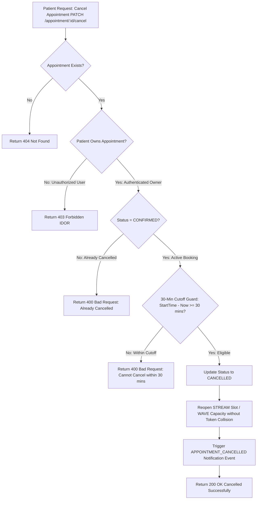
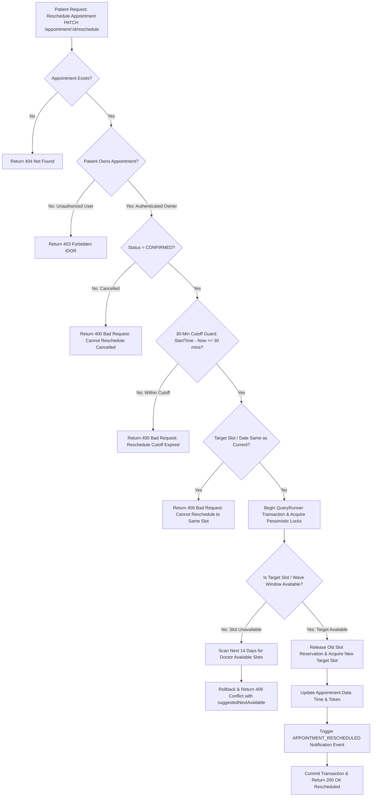
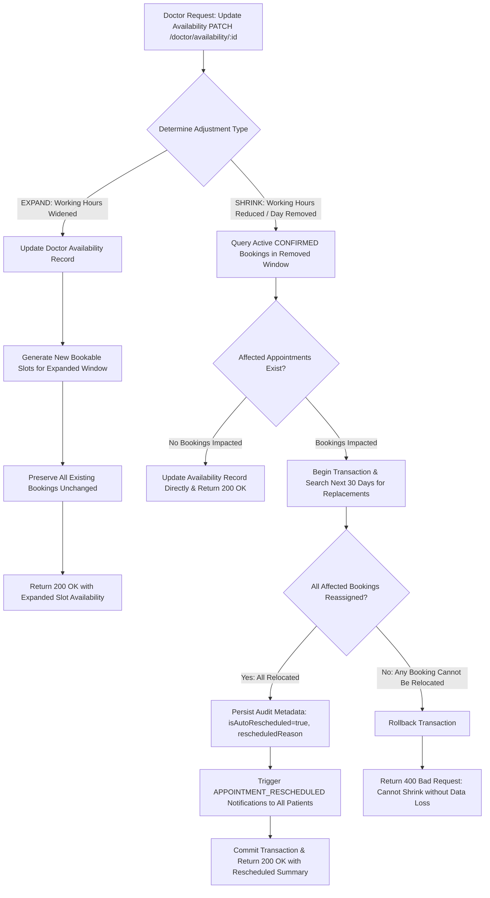
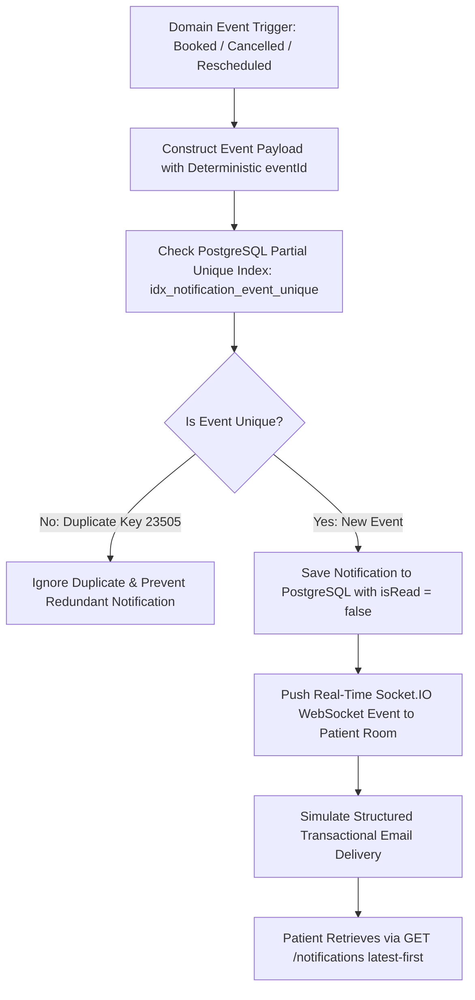
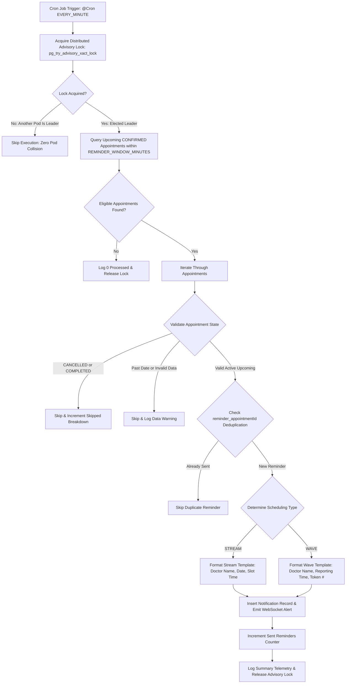

# 📊 Schedula System Architecture & Workflow Flowcharts

This document details the end-to-end operational workflows and engineering flowcharts for all scheduling strategies, event notifications, elastic adjustments, and background cron reminder jobs in **Schedula**.

---

## 1. 🗓️ STREAM Appointment Booking Flow

---

## 2. 🎟️ WAVE Appointment Booking & Token Assignment Flow

---

## 3. 🚫 Appointment Cancellation & 30-Minute Cutoff Guard

---

## 4. 🔄 Appointment Rescheduling & Conflict Alternative Discovery

---

## 5. 📐 Elastic Scheduling (Shrink & Expand Availability)

---

## 6. 🔔 Event-Based Notification System Workflow

---

## 7. ⏰ Automated Appointment Reminder Cron Scheduler

