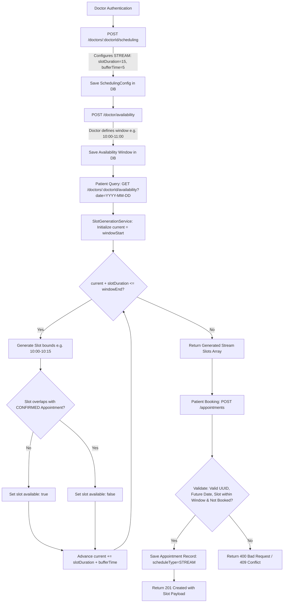
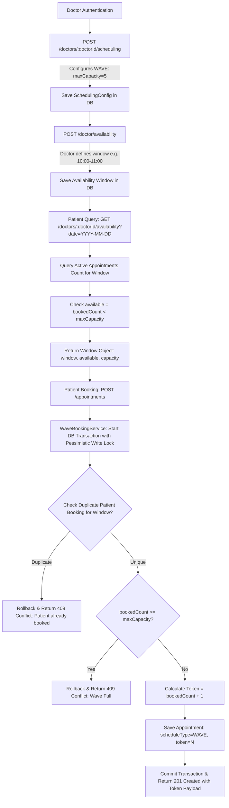

# Advanced Doctor Scheduling System — Architecture & Flowcharts

This document provides system architecture flowcharts for **STREAM** and **WAVE** scheduling strategies.

---

## 1. STREAM Scheduling Workflow

STREAM scheduling automatically divides doctor availability windows into fixed-duration consultation slots separated by buffer times.

---

## 2. WAVE Scheduling Workflow

WAVE scheduling assigns patient arrival tokens for a common time window up to a configured maximum capacity, enforcing sequential token generation without race conditions.

