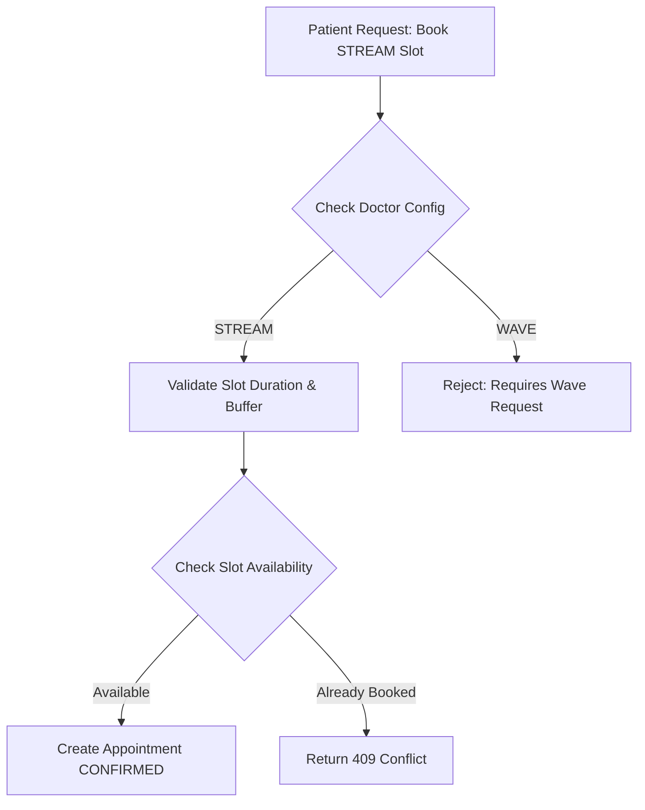
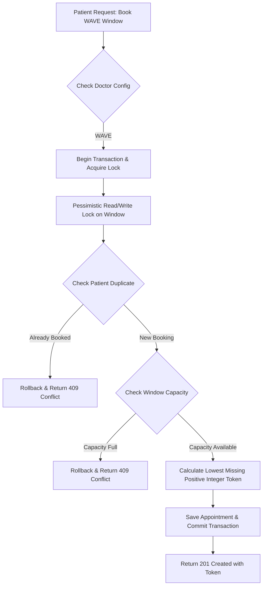
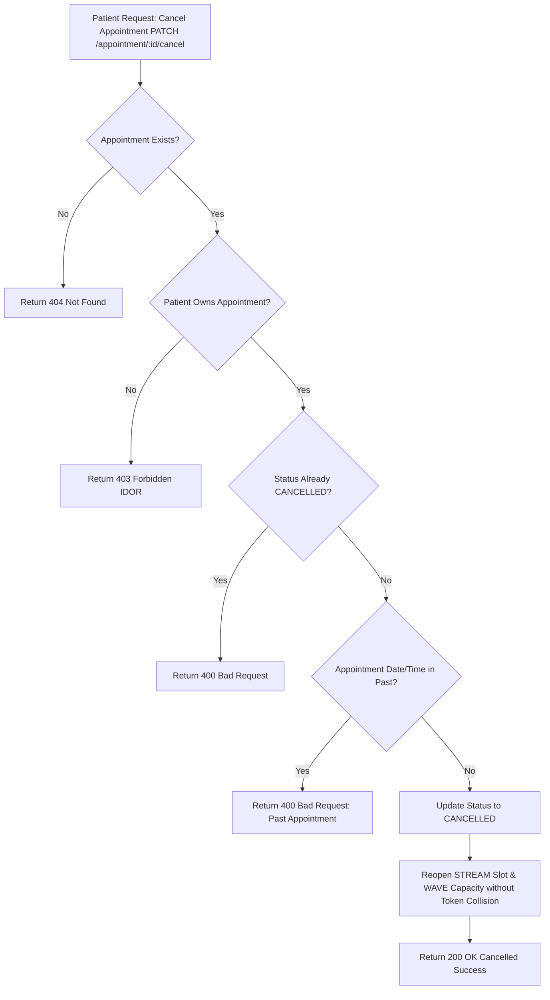

# Advanced Doctor Scheduling & Appointment Management Architecture Flowcharts

```mermaid
graph TD
    A[Patient Request: Book STREAM Slot] --> B{Check Doctor Config}
    B -->|STREAM| C[Validate Slot Duration & Buffer]
    C --> D{Check Slot Availability}
    D -->|Available| E[Create Appointment CONFIRMED]
    D -->|Already Booked| F[Return 409 Conflict]
    B -->|WAVE| G[Reject: Requires Wave Request]
```

```mermaid
graph TD
    A[Patient Request: Book WAVE Window] --> B{Check Doctor Config}
    B -->|WAVE| C[Begin Transaction & Acquire Lock]
    C --> D[Pessimistic Read/Write Lock on Window]
    D --> E{Check Patient Duplicate}
    E -->|Already Booked| F[Rollback & Return 409 Conflict]
    E -->|New Booking| G{Check Window Capacity}
    G -->|Capacity Full| H[Rollback & Return 409 Conflict]
    G -->|Capacity Available| I[Calculate Lowest Missing Positive Integer Token]
    I --> J[Save Appointment & Commit Transaction]
    J --> K[Return 201 Created with Token]
```

```mermaid
graph TD
    A[Patient Request: Cancel Appointment PATCH /appointment/:id/cancel] --> B{Appointment Exists?}
    B -->|No| C[Return 404 Not Found]
    B -->|Yes| D{Patient Owns Appointment?}
    D -->|No| E[Return 403 Forbidden IDOR]
    D -->|Yes| F{Status Already CANCELLED?}
    F -->|Yes| G[Return 400 Bad Request]
    F -->|No| H{Appointment Date/Time in Past?}
    H -->|Yes| I[Return 400 Bad Request: Past Appointment]
    H -->|No| J[Update Status to CANCELLED]
    J --> K[Reopen STREAM Slot & WAVE Capacity without Token Collision]
    K --> L[Return 200 OK Cancelled Success]
```
