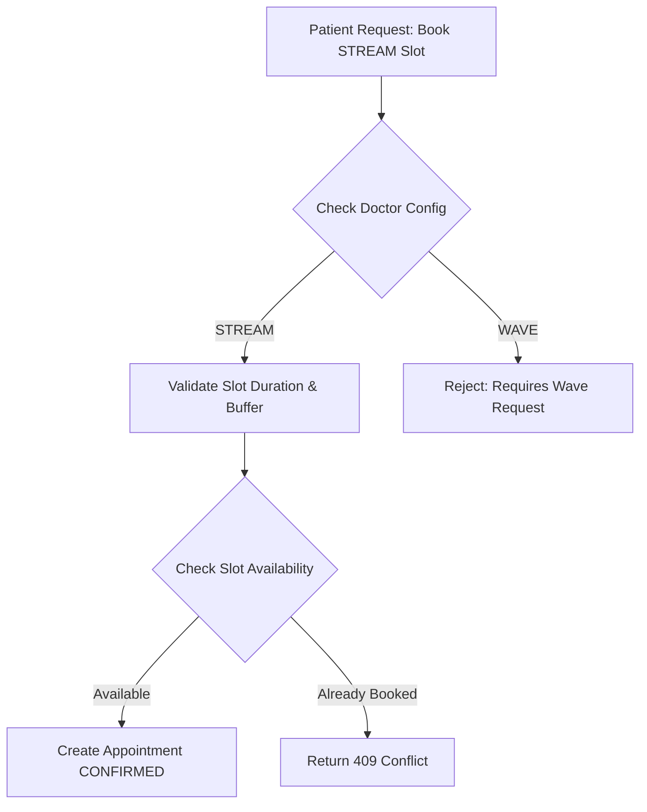
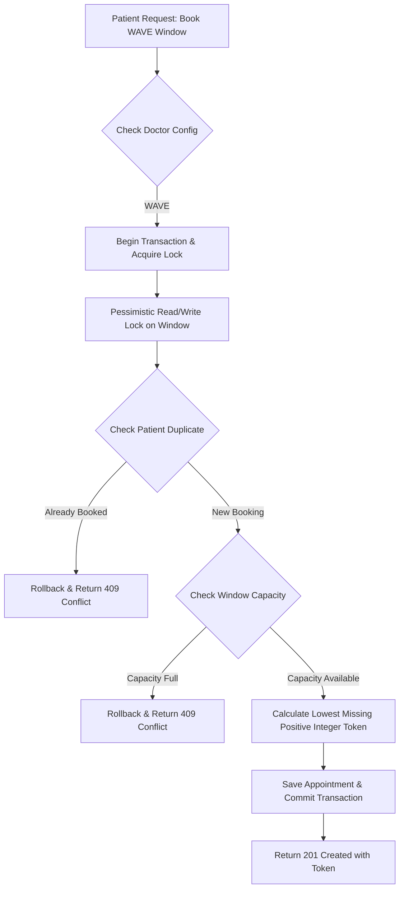
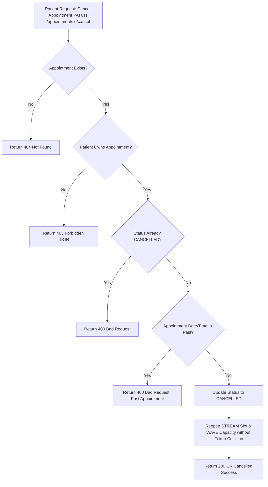
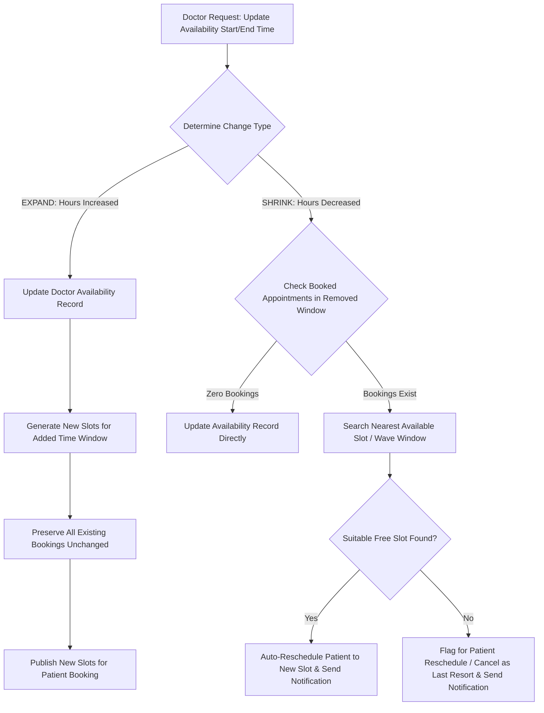

# Advanced Doctor Scheduling & Appointment Management Architecture Flowcharts









````mermaid
graph TD
    A[Patient Request: Reschedule Appointment PATCH /appointment/:id/reschedule] --> B{Appointment Exists?}
    B -->|No| C[Return 404 Not Found]
    B -->|Yes| D{Patient Owns Appointment?}
    D -->|No| E[Return 403 Forbidden IDOR]
    D -->|Yes| F{Status = CONFIRMED?}
    F -->|No| G[Return 400 Bad Request: Cancelled Appointment]
    F -->|Yes| H{30-Min Cutoff Check: start - now >= 30 mins?}
    H -->|No| I[Return 400 Bad Request: Cutoff Expired]
    H -->|Yes| J{Target Slot / Wave Same as Current?}
    J -->|Yes| K[Return 400 Bad Request: Same Slot]
    J -->|No| L[Begin Database Transaction & Acquire Pessimistic Lock]
    L --> M{Is Target Slot / Wave Window Available?}
    M -->|No| N[Find Suggested Next Available Slot up to 14 Days Ahead]
    N --> O[Rollback & Return 409 Conflict with suggestedNextAvailable]
    M -->|Yes| P[Release Old Slot / WAVE Token & Reserve New Target Slot / WAVE Token]
    P --> Q[Commit Transaction & Return 200 OK Rescheduled]

```mermaid
graph TD
    A[Cron Job Trigger: @Cron EVERY_MINUTE] --> B[Fetch Active CONFIRMED Appointments within REMINDER_WINDOW_MINUTES]
    B --> C{Appointments Found?}
    C -->|No| D[Log Zero Eligible Appointments & End Execution]
    C -->|Yes| E[Loop Through Each Appointment]
    E --> F{Check Appointment Status & Data}
    F -->|CANCELLED or COMPLETED| G[Skip: Excluded from Reminders]
    F -->|Incomplete / Invalid Data| H[Skip & Log Invalid Data]
    F -->|Valid Upcoming Appointment| I{Check Event Deduplication Index}
    I -->|reminder_${appointment.id} Already Exists| J[Skip: Duplicate Reminder Prevented]
    I -->|First Reminder| K[Determine Strategy Type]
    K -->|STREAM| L[Format Stream Message: Doctor Name, Date, Slot Time]
    K -->|WAVE| M[Format Wave Message: Doctor Name, Reporting Time, Token Number]
    L --> N[Insert Notification & Broadcast Real-Time WebSocket Event]
    M --> N
    N --> O[Log Reminder Created Successfully]
```
````
