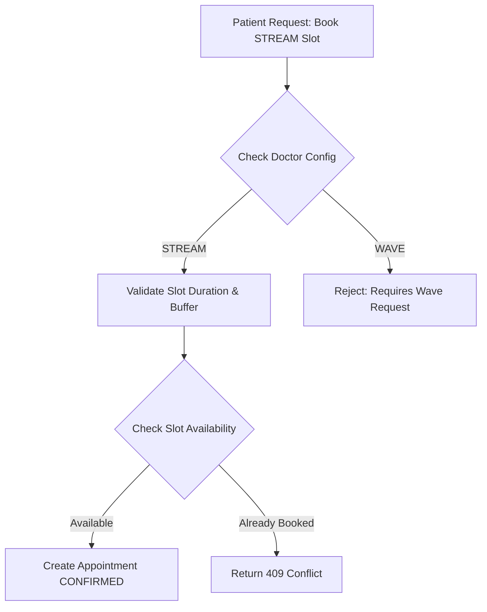
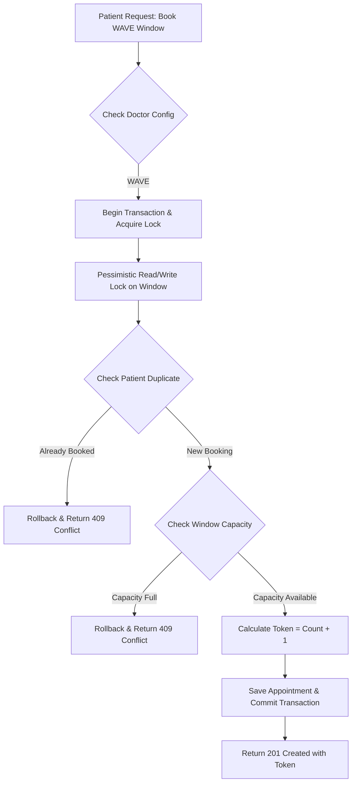

# Advanced Doctor Scheduling Architecture Flowcharts

```mermaid
graph TD
    A[Patient Request: Book STREAM Slot] --> B{Check Doctor Config}
    B -->|STREAM| C[Validate Slot Duration & Buffer]
    C --> D{Check Slot Availability}
    D -->|Available| E[Create Appointment CONFIRMED]
    D -->|Already Booked| F[Return 409 Conflict]
    B -->|WAVE| G[Reject: Requires Wave Request]
```

```mermaid
graph TD
    A[Patient Request: Book WAVE Window] --> B{Check Doctor Config}
    B -->|WAVE| C[Begin Transaction & Acquire Lock]
    C --> D[Pessimistic Read/Write Lock on Window]
    D --> E{Check Patient Duplicate}
    E -->|Already Booked| F[Rollback & Return 409 Conflict]
    E -->|New Booking| G{Check Window Capacity}
    G -->|Capacity Full| H[Rollback & Return 409 Conflict]
    G -->|Capacity Available| I[Calculate Token = Count + 1]
    I --> J[Save Appointment & Commit Transaction]
    J --> K[Return 201 Created with Token]
```
